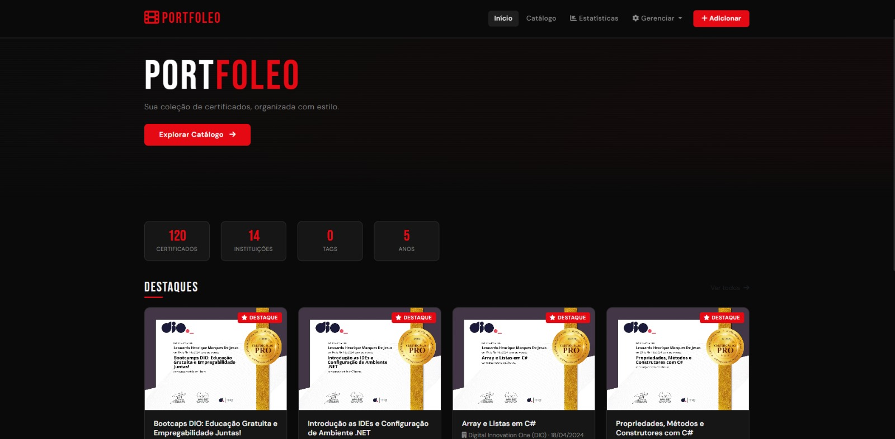
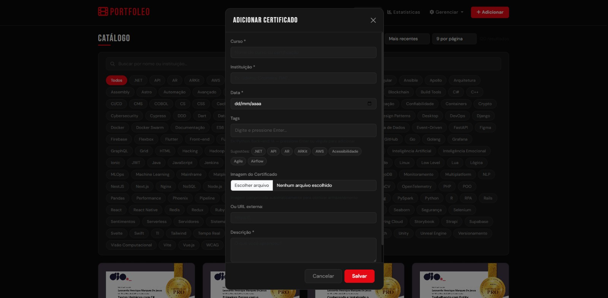
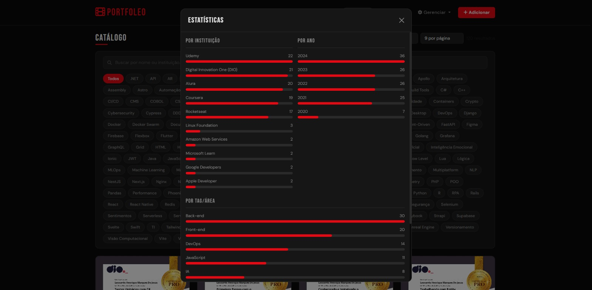

<div align="center">

# 🎬 PortFoleo

**Sua coleção de certificados, organizada com estilo.**



[](https://leomarxs.github.io/PortfoLeo/)
[](https://developer.mozilla.org/pt-BR/docs/Web/HTML)
[](https://developer.mozilla.org/pt-BR/docs/Web/CSS)
[](https://developer.mozilla.org/pt-BR/docs/Web/JavaScript)
[](https://getbootstrap.com/)

</div>

---

## 📋 Sobre o Projeto

O **PortFoleo** é um catálogo pessoal de certificados inspirado na interface do Netflix. Desenvolvido com HTML, CSS e JavaScript puro, permite organizar, visualizar e compartilhar certificados de cursos e certificações de forma elegante e intuitiva.

> 🎯 **Objetivo:** Ter um portfólio de certificados profissional, bonito e fácil de gerenciar, hospedado gratuitamente no GitHub Pages.

---

## ✨ Funcionalidades

### 🏠 Página Inicial
- Hero section com apresentação do portfólio
- **Cards de estatísticas** com total de certificados, instituições, tags e anos
- Seção de **Destaques** com os certificados marcados como favoritos

### 📂 Catálogo
- Grid responsivo com todos os certificados
- **Busca em tempo real** por nome, instituição ou descrição
- **Filtro por tags** (ex: Python, Back-end, IA, DevOps...)
- Ordenação por data (mais recente/antigo) ou nome (A-Z / Z-A)
- Paginação configurável (9, 12, 18 ou 24 por página)

### 📊 Estatísticas
- Gráfico de barras por **Instituição**
- Gráfico de barras por **Ano**
- Gráfico de barras por **Tag/Área**

### ➕ Gerenciamento
- **Adicionar** certificados com upload de imagem ou URL externa
- **Editar** informações de qualquer certificado
- **Remover** certificados individualmente
- **Marcar como destaque** para aparecer na página inicial
- Sistema de **tags personalizadas** com sugestões automáticas
- **Compressão automática** de imagens para economizar espaço

### 🔄 Dados
- Certificados carregados a partir do `certificates.json`
- Salvamento automático no **localStorage** do navegador
- **Exportar** dados como backup `.json`
- **Importar** dados de um arquivo `.json`
- **Recarregar JSON** para sincronizar com o arquivo original

### 📤 Compartilhamento
- **Baixar imagem** do certificado diretamente
- **Copiar texto** formatado para redes sociais

---

## 🖥️ Screenshots

| Página Inicial | Catálogo | Estatísticas |
|---|---|---|
|  |  |  |

---

## 🚀 Como Usar

### 1. Clone o repositório
```bash
git clone https://github.com/LeoMarxs/__PortfoLeo__.git
cd __PortfoLeo__
```

### 2. Estrutura de pastas
```
📁 __PortfoLeo__/
├── 📄 index.html           ← aplicação principal
├── 📄 certificates.json    ← banco de dados dos certificados
├── 📄 README.md
└── 📁 certificados/        ← imagens dos certificados
    ├── 🖼️ 2.webp
    ├── 🖼️ 3.webp
    └── ...
```

### 3. Adicione seus certificados no `certificates.json`
```json
{
  "movies": [
    {
      "id": 1,
      "title": "Nome do Curso",
      "director": "Instituição",
      "year": "2024-07-26",
      "tags": ["Python", "Back-end"],
      "genres": ["Python", "Back-end"],
      "image": "certificados/2.webp",
      "description": "O que você aprendeu neste curso.",
      "featured": true
    }
  ],
  "nextId": 2
}
```

### 4. Abra no navegador
Use o **Live Server** do VS Code ou qualquer servidor local.

> ⚠️ O carregamento do `certificates.json` via `fetch` requer um servidor local ou hospedagem. Não funciona abrindo o arquivo diretamente pelo Windows/Mac.

---

## 🔄 Como Atualizar os Certificados

O fluxo para adicionar ou editar certificados é simples:

**Editando direto no JSON** (para mudanças em massa):
```
1. Edite o certificates.json no seu editor
2. git add certificates.json
3. git commit -m "Atualiza certificados"
4. git push
✅ GitHub Pages atualiza em ~1 minuto
```

**Editando pelo site** (para mudanças pontuais):
```
1. Edite o certificado normalmente no site
2. Gerenciar → Exportar Dados
3. Renomeie o arquivo baixado para certificates.json
4. Substitua o arquivo no repositório
5. git add . → git commit → git push
✅ GitHub Pages atualiza em ~1 minuto
```

---

## 📁 Formato do certificates.json

| Campo | Tipo | Descrição |
|---|---|---|
| `id` | number | Identificador único (não repetir) |
| `title` | string | Nome do curso ou certificação |
| `director` | string | Nome da instituição |
| `year` | string | Data no formato `AAAA-MM-DD` |
| `tags` | array | Lista de tags (ex: `["Python", "IA"]`) |
| `genres` | array | Igual ao `tags` (compatibilidade) |
| `image` | string | Caminho local ou URL da imagem |
| `description` | string | Descrição do que foi aprendido |
| `featured` | boolean | `true` para aparecer nos Destaques |

---

## 🛠️ Tecnologias

| Tecnologia | Uso |
|---|---|
| HTML5 | Estrutura da aplicação |
| CSS3 + Variáveis CSS | Estilização e tema escuro |
| JavaScript (ES6+) | Lógica, filtros e paginação |
| Bootstrap 5 | Grid, modais e componentes |
| Font Awesome 6 | Ícones |
| Google Fonts (Bebas Neue + DM Sans) | Tipografia |
| localStorage | Persistência local dos dados |

---

## 🌐 Hospedagem no GitHub Pages

1. Vá em **Settings** do repositório
2. Clique em **Pages** no menu lateral
3. Em **Source**, selecione `Deploy from a branch`
4. Escolha a branch `main` e a pasta `/ (root)`
5. Clique em **Save**

O site estará disponível em:
```
https://leomarxs.github.io/__PortfoLeo__/
```

---

## 📜 Licença

Este projeto é de uso pessoal. Sinta-se livre para adaptar para o seu próprio portfólio.

---

<div align="center">


[](https://github.com/LeoMarxs)

</div>
